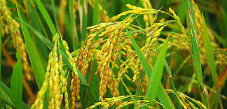
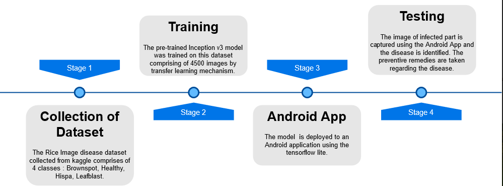

<h1 align="center">
   
  
   
  OrAIza
   
</h1>

<h4 align="center">An andriod application to detect and classify paddy pest diseases.</h4>

&emsp;&emsp;&emsp;&emsp;&emsp;&emsp;&emsp;&emsp;&emsp;
[![Contributors][contributors-shield]][contributors-url]
[![Forks][forks-shield]][forks-url]
[![Stargazers][stars-shield]][stars-url]
[![Issues][issues-shield]][issues-url]

[![MIT License][license-shield]][license-url]
[![LinkedIn][linkedin-shield]][linkedin-url]

# Basic Overview

  

More than a billion people live in smallholder farmer households worldwide, and many of these farmers struggle with avoidable pest damage that can wipe out up to 50% of annual paddy crop yield. Abundant use of chemicals such as bactericides, fungicides, and nematicides to control plant diseases has been causing adverse effects in the agro-ecosystem. Currently, there is a need for effective early disease detection techniques to control plant diseases for food security and the sustainability of the agro-ecosystem. In this project, as farmers and agriculture program workers take regular photos of pest disease traps, AI models on their phones classify and detect the pest diseases. The data will be used to provide millions of farmers with timely, localized advice to reduce pesticide usage and improve the yield. Smartphones, in particular, offer a very novel approach to help identify diseases because of their computing power, high-resolution displays, and extensive built-in sets of accessories, such as advanced HD cameras. This app can help quickly identify paddy diseases and provide treatment information, taking us one step closer to better economic and food security.

## About The Project
An android application is developed using a deep learning model with the transfer learning technique. Around 4500 images of plant leaves have been analyzed, which have a spread of 4 class labels assigned to them. Each class label is a paddy pest disease such as Brownspot, Hispa, Leaf Blast. These are considered as some of the major paddy diseases. An attempt is made to predict the disease given just the image of the plant leaf. A deep learning-based CNN architecture is proposed to detect and classify paddy diseases. The advancement and novelty of the developed model lie in its simplicity; healthy leaves are in line with other classes, enabling the model to distinguish between diseased leaves and healthy ones or from the environment by using CNN. The popular architecture, namely Inception V3 is a widely-used image recognition model that has been shown to attain greater than 78.1% accuracy on the ImageNet dataset. The model itself is made up of symmetric and asymmetric building blocks, including convolutions, average pooling, max pooling, concats, dropouts, and fully connected layers. Batchnorm is used extensively throughout the model and applied to activation inputs. Loss is computed via Softmax.
A high-level diagram of the model is shown below :

  

The model is then retrained by freezing some of its layers by fine tuning.This approach is called transfer learning. The tensorflow model is then quantized to tensorflow lite model and then deployed on to a Mobile device through Android Studio application. 

## Workflow of project

  

&nbsp;

Everything you need to recreate this project is on the jupyter notebook. Everything was coded in Google Colab, because of its GPU. I uploaded the dataset to Google Drive, so you can download it directly. For more details, the notebook includes the instructions to follow.

You can find the requirements in [requirements.txt](requirements.txt), but everything is in the notebook, so you can install all by using pip install. I recommend using Google Colab.

This project was created under the Deloitte TechnoUtsav3.0 TechE contest.

## Contributing

Contributions are what make the open source community such an amazing place to be learn, inspire, and create. Any contributions you make are **greatly appreciated**.

1. Fork the Project
2. Create your Feature Branch (`git checkout -b feature/AmazingFeature`)
3. Commit your Changes (`git commit -m 'Add some AmazingFeature'`)
4. Push to the Branch (`git push origin feature/AmazingFeature`)
5. Open a Pull Request

Pull requests are welcome. For major changes, please open an issue first to discuss what you would like to change.

## Authors
* **Manikanta Varaganti** - *Initial work* - [orAIza](https://github.com/m2i101/)

* **Aakanksha Thota** - *Initial work* - [orAIza](https://github.com/Aakanksha-Thota/)

* **Sai Santhosh Belide** - *Initial work* - [orAIza](https://www.linkedin.com/in/sai-santhosh-belide-19349516b/)

[contributors-shield]: https://img.shields.io/github/contributors/m2i101/orAIza
[contributors-url]: https://github.com/m2i101/orAIza/graphs/contributors
[forks-shield]: https://img.shields.io/github/forks/m2i101/orAIza
[forks-url]: https://github.com/m2i101/orAIza/network/members
[stars-shield]: https://img.shields.io/github/stars/m2i101/orAIza
[stars-url]: https://github.com/m2i101/orAIza/stargazers
[issues-shield]: https://img.shields.io/github/issues/m2i101/orAIza
[issues-url]: https://github.com/m2i101/orAIza/issues
[license-shield]: https://img.shields.io/github/license/m2i101/orAIza.svg?style=flat-square
[license-url]: https://github.com/m2i101/orAIza/blob/master/LICENSE.txt
[linkedin-shield]: https://img.shields.io/badge/-LinkedIn-black.svg?style=flat-square&logo=linkedin&colorB=555
[linkedin-url]: https://linkedin.com/in/manikanta-varaganti-8b1a58182

